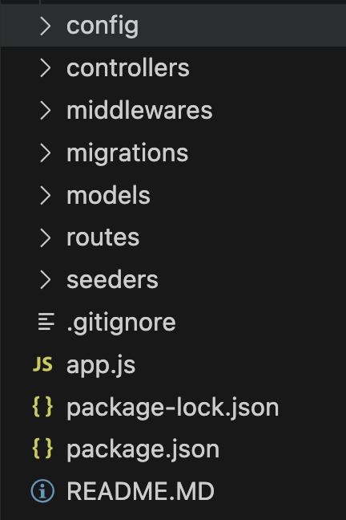

# vocasia-ip-server
Individual Project - Server Side

## Instruction
Pada tugas kali ini merupakan titik terakhir dalam kegiatan Fullstack dari sisi BackEnd
Kalian diminta untuk membuat Server (BE) ddari suatu Aplikasi dengan tema "Bebas", kalian bisa membuat ecommerce, kanban (todo), atau library app, recipe app, topik "dibebaskan"
dengan persyaratan dibawah, Server kalian ini akan digunakan untuk Integrasi pada Tugas Individual Project dari sisi Client (FE).

### Prequisite 
Tiap dari tugas Backend kalian harus mempunyai:
- A User Authentication System (Login, Register).
- A User Authorization System (Owned, Role-Based (admin, nonadmin), Account Based (seller, buyer)).
- CRUD (Create, Read, Update, Delete) suatu Data yang ada own-based data (userId), dengan membawa Auth token untuk pembuatan Owned CRUD nya.
- Menggunakan Sequelize + Sequelize-Cli dengan MySQL.
- Membuat ERD serta capture desain tersebut ke dalam folder ./assets, dan melakukan Migration menggunakan sequelie-cli yang jelas (tidak via GUI(dbeaver, mysql workbench, dsb)).
- Seeding data User, User dengan role khusus, atau Master Data yang kalian tentukan (product, buku, etc).
- Validation dari tiap data pada model (User dibuat unique pada method dia login(email/phone_number jika ada), dan pada column yang lain menyesuaikan misalnya email hanya boleh email, password minimal 6 karakter etc).
- Sequelize-Hooks (dibebaskan, tapi setidaknya ada hooks yang digunakan, contoh beforeCreate Password mengubah password menjadi Hashed password).
- Implement Security (Auth based CRUD hanya bisa diedit oleh pemilik dsb menggunakan Json Web Token).
- Implement Error Handling menggunakan Error Handler buatan kalian sendiri.
- Structuring Folder Mode Controller seperti pada gambar
  
- Membuat Postman Collection dan api-doc.md kalian sendiri setelah menyelesaikan API yg dibuat (diexport kemudian disimpan pada folder Assets)
- Tambahan!!, Menggunakan Package dari npmjs yang belum pernah diajari selama lecture, kalian bisa explore apa yg kalian ingin pakai. 

### Cara Pengumpulan Tugas
Buatlah repository pada akun github masing2, lakukan pengerjaan pada repo yang telah kalian buat, lakukan merge request pada repository vocasia jika telah selesai. Pada deskripsi MR berikan penjelasan mengenai apa yang telah buat dan library baru apa yang telah kalian gunakan.